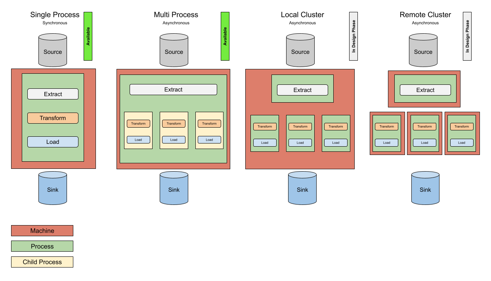
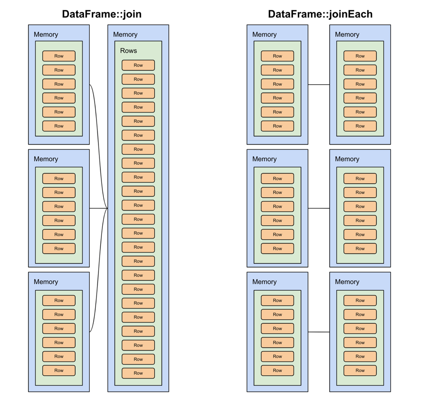

[](https://packagist.org/packages/flow-php/etl)
[](https://packagist.org/packages/flow-php/etl)
[](https://packagist.org/packages/flow-php/etl)


Supported PHP versions

* [](https://php.net/)

## Description

Flow is a most advanced and flexible PHP, data processing library.

Except typical ETL use cases (Extract, Transform, Load), Flow can be also used for memory-safe data analysis.

## Installation

```bash
composer require flow-php/etl:1.x@dev
```

Until project get first stable release it's recommended to lock it to specific
commit version in your composer.lock file. 

## Typical Use Cases

* Sync data from external systems (API)
* File processing
* Pushing data to external systems
* Data migrations

Using this library makes sense when we need to move data from one place to another, doing some transformations in between.

For example, let's say we must synchronize data from external API periodically, transform them into our internal
data structure, filter out things that didn't change, and load in bulk into the database.

This is a perfect scenario for ETL.

## Usage

Examples: 

```php
<?php

use Flow\ETL\DSL\From;
use Flow\ETL\DSL\Transform;
use Flow\ETL\DSL\To;
use Flow\ETL\ETL;
use Flow\ETL\Flow;
use Flow\ETL\Memory\ArrayMemory;
use Flow\ETL\Row\Sort;
use Flow\ETL\Rows;

$array = new ArrayMemory();

(new Flow())
    ->read(From::rows(new Rows()))
    ->rows(Transform::keep(['id', 'name', 'status']))
    ->sortBy(Sort::desc('status'))
    ->write(To::memory($array)
    ->run();
```

### [More Examples](https://github.com/flow-php/etl-examples)

## DSL - Domain Specific Language

Flow comes with a rich DSL that will make code more readable and easier to understand,
due to language limitations DSL is available through static methods on following classes:

* [Entry](src/Flow/ETL/DSL/Entry.php)
* [Handler](src/Flow/ETL/DSL/Handler.php)
* [From](src/Flow/ETL/DSL/From.php) - Readers (Extractors)
* [Transform](src/Flow/ETL/DSL/Transform.php)  - Transformers
  * [Condition](src/Flow/ETL/DSL/Condition.php) 
* [To](src/Flow/ETL/DSL/To.php) - Writers (Loaders)

Adapters should deliver their own DSL, so for example Json Adapter should create custom `ToJson` and `FromJson` 
classes with own methods. 

By design all methods in DSL are marked as final (they are not an extension points) but
classes itself can be extended in case you would like to add your own custom elements.

## Configuration

Some configuration options can be passed through environment variables, list below: 

- `FLOW_LOCAL_FILESYSTEM_CACHE_DIR` - location of default local filesystem cache, default: `\sys_get_temp_dir()`
- `FLOW_EXTERNAL_SORT_MAX_MEMORY` - amount of memory to use for sorting, default: `200M` 

To get more control over how Flow is processing data frames please use [Config](src/Flow/ETL/Config.php) than can be created
through [ConfigBuilder](src/Flow/ETL/ConfigBuilder.php).

```php
<?php

$config = Config::builder()
  ->cache(new MyCustomCache());

Flow::setUp($config)
    ->extract($extractor)
    ->transform($transformer)
    ->write($loader)
    ->run();
```

Configuration makes possible to setup following options:

- `id` - unique identifier of ETL instance
- `cache` - implementation of [Cache](src/Flow/ETL/Cache.php) interface
- `external sort` - implementation of [External Sort](src/Flow/ETL/ExternalSort.php) interface
- `serializer` - implementation of [Serializer](src/Flow/Serializer/Serializer.php) interface
- `pipeline` - implementation of [Pipeline](src/Flow/ETL/Pipeline.php) interface

## Features

* Constant memory consumption even when processing millions of records
* Type safe Rows/Row/Entry abstractions
* Filtering
* Sorting 
* Caching
* Built in Rows objects comparison
* Rich collection of entry types and generic transformers 
* Out of the box support for popular data sources/sinks 
* Simple API
* Schema Definition

## Row Entries

All entries are available through [DSL\Entry](src/Flow/ETL/DSL/Entry.php)

* [array](src/Flow/ETL/Row/Entry/ArrayEntry.php)
* [boolean](src/Flow/ETL/Row/Entry/BooleanEntry.php)
* [collection](src/Flow/ETL/Row/Entry/CollectionEntry.php)
* [datetime](src/Flow/ETL/Row/Entry/DateTimeEntry.php)
* [enum](src/Flow/ETL/Row/Entry/EnumEntry.php)
* [float](src/Flow/ETL/Row/Entry/FloatEntry.php)
* [integer](src/Flow/ETL/Row/Entry/IntegerEntry.php)
* [json](src/Flow/ETL/Row/Entry/JsonEntry.php)  
* [list](src/Flow/ETL/Row/Entry/ListEntry.php) - strongly typed array
* [null](src/Flow/ETL/Row/Entry/NullEntry.php)
* [object](src/Flow/ETL/Row/Entry/ObjectEntry.php)
* [string](src/Flow/ETL/Row/Entry/StringEntry.php)
* [structure](src/Flow/ETL/Row/Entry/StructureEntry.php)

While adding new entry type, please follow the [checklist](docs/new_type.md). 

> Entry names are case-sensitive, `entry` is not the same as `Entry`.

## Extractors aka Readers

All generic extractors are available through [DSL\From](src/Flow/ETL/DSL/From.php)

In most cases Extractors (Readers) should be provided by Adapters which you can find below, however there are few generic readers,
please find them below.  
Please read [tests](tests/Flow/ETL/Tests/Unit/Extractor) to find examples of usage.

* [buffer](src/Flow/ETL/Extractor/BufferExtractor.php) - [tests](tests/Flow/ETL/Tests/Unit/Extractor/BufferExtractorTest.php)
* [cache](src/Flow/ETL/Extractor/CacheExtractor.php) - [tests](tests/Flow/ETL/Tests/Unit/Extractor/CacheExtractorTest.php)
* [chain](src/Flow/ETL/Extractor/ChainExtractor.php) - [tests](tests/Flow/ETL/Tests/Unit/Extractor/ChainExtractorTest.php)
* [chunk](src/Flow/ETL/Extractor/ChunkExtractor.php) - [tests](tests/Flow/ETL/Tests/Unit/Extractor/ChunkExtractorTest.php)  
* [memory](src/Flow/ETL/Extractor/MemoryExtractor.php) - [tests](tests/Flow/ETL/Tests/Unit/Extractor/MemoryExtractorTest.php)
* [pipeline](src/Flow/ETL/Extractor/PipelineExtractor.php) - [tests](tests/Flow/ETL/Tests/Unit/Extractor/PipelineExtractorTest.php)  
* [process](src/Flow/ETL/Extractor/ProcessExtractor.php) - [tests](tests/Flow/ETL/Tests/Unit/Extractor/ProcessExtractorTest.php)

## Transformers

All generic transformers are available through [DSL\Transform](src/Flow/ETL/DSL/Transform.php)

Transformers can be registered in the pipeline through following methods:

* `DataFrame::transformer(Transformer $transformer) : DataFrame`
* `DataFrame::rows(Transformer $transformer) : DataFrame`

Set of ETL generic Transformers, for the detailed usage instruction please look into [tests](tests/Flow/ETL/Tests/Unit/Transformer).
Adapters might also define some custom transformers.

* **Generic**
    * [cast](src/Flow/ETL/Transformer/CastTransformer.php) - [tests](tests/Flow/ETL/Tests/Unit/Transformer/CastTransformerTest.php)
    * [chain](src/Flow/ETL/Transformer/ChainTransformer.php) - [tests](tests/Flow/ETL/Tests/Unit/Transformer/ChainTransformerTest.php)
    * [clone entry](src/Flow/ETL/Transformer/CloneEntryTransformer.php) - [tests](tests/Flow/ETL/Tests/Unit/Transformer/CloneEntryTransformerTest.php)
    * [conditional](src/Flow/ETL/Transformer/ConditionalTransformer.php) - [tests](tests/Flow/ETL/Tests/Unit/Transformer/ConditionalTransformerTest.php)
    * [dynamic entry](src/Flow/ETL/Transformer/DynamicEntryTransformer.php) - [tests](tests/Flow/ETL/Tests/Unit/Transformer/DynamicEntryTransformerTest.php)
    * [entry name style converter](src/Flow/ETL/Transformer/EntryNameStyleConverterTransformer.php) - [tests](tests/Flow/ETL/Tests/Unit/Transformer/DynamicEntryTransformerTest.php)
    * [filter rows](src/Flow/ETL/Transformer/FilterRowsTransformer.php) - [tests](tests/Flow/ETL/Tests/Unit/Transformer/FilterRowsTransformerTest.php)
    * [hash - non-cryptographic](src/Flow/ETL/Transformer/HashTransformer.php) - [tests](tests/Flow/ETL/Tests/Unit/Transformer/HashTransformerTest.php)
    * [group to array](src/Flow/ETL/Transformer/GroupToArrayTransformer.php) - [tests](tests/Flow/ETL/Tests/Unit/Transformer/GroupToArrayTransformerTest.php)
    * [keep entries](src/Flow/ETL/Transformer/KeepEntriesTransformer.php) - [tests](tests/Flow/ETL/Tests/Unit/Transformer/KeepEntriesTransformerTest.php)
    * [math operation](src/Flow/ETL/Transformer/MathOperationTransformer.php) - [tests](tests/Flow/ETL/Tests/Unit/Transformer/MathOperationTransformerTest.php)
    * [math value operation](src/Flow/ETL/Transformer/MathValueOperationTransformer.php) - [tests](tests/Flow/ETL/Tests/Unit/Transformer/MathValueOperationTransformerTest.php)
    * [remove entries](src/Flow/ETL/Transformer/RemoveEntriesTransformer.php) - [tests](tests/Flow/ETL/Tests/Unit/Transformer/RemoveEntriesTransformerTest.php)
    * [rename entries](src/Flow/ETL/Transformer/RenameEntriesTransformer.php) - [tests](tests/Flow/ETL/Tests/Unit/Transformer/RenameEntriesTransformerTest.php)
    * [static entry](src/Flow/ETL/Transformer/StaticEntryTransformer.php) - [tests](tests/Flow/ETL/Tests/Unit/Transformer/StaticEntryTransformerTest.php)
* **Array**
    * [array collection get](src/Flow/ETL/Transformer/ArrayCollectionGetTransformer.php) - [tests](tests/Flow/ETL/Tests/Unit/Transformer/ArrayCollectionGetTransformerTest.php)
    * [array collection merge](src/Flow/ETL/Transformer/ArrayCollectionMergeTransformer.php) - [tests](tests/Flow/ETL/Tests/Unit/Transformer/ArrayCollectionMergeTransformerTest.php)
    * [array dot get](src/Flow/ETL/Transformer/ArrayDotGetTransformer.php) - [tests](tests/Flow/ETL/Tests/Unit/Transformer/ArrayDotGetTransformerTest.php)
    * [array rename](src/Flow/ETL/Transformer/ArrayDotRenameTransformer.php) - [tests](tests/Flow/ETL/Tests/Unit/Transformer/ArrayDotRenameTransformerTest.php)
    * [array expand](src/Flow/ETL/Transformer/ArrayExpandTransformer.php) - [tests](tests/Flow/ETL/Tests/Unit/Transformer/ArrayExpandTransformerTest.php)
    * [array keys style converter](src/Flow/ETL/Transformer/ArrayKeysStyleConverterTransformer.php) - [tests](tests/Flow/ETL/Tests/Unit/Transformer/ArrayKeysStyleConverterTransformerTest.php)
    * [array merge](src/Flow/ETL/Transformer/ArrayMergeTransformer.php) - [tests](tests/Flow/ETL/Tests/Unit/Transformer/ArrayMergeTransformerTest.php)
    * [array reverse](src/Flow/ETL/Transformer/ArrayMergeTransformer.php) - [tests](tests/Flow/ETL/Tests/Unit/Transformer/ArrayMergeTransformerTest.php)
    * [array sort](src/Flow/ETL/Transformer/ArraySortTransformer.php) - [tests](tests/Flow/ETL/Tests/Unit/Transformer/ArraySortTransformerTest.php)
    * [array unpack](src/Flow/ETL/Transformer/ArrayUnpackTransformer.php) - [tests](tests/Flow/ETL/Tests/Unit/Transformer/ArrayUnpackTransformerTest.php)
* **Object**
    * [object method](src/Flow/ETL/Transformer/ObjectMethodTransformer.php) - [tests](tests/Flow/ETL/Tests/Unit/Transformer/ObjectMethodTransformerTest.php)
    * [object to array](src/Flow/ETL/Transformer/ObjectToArrayTransformer.php) - [tests](tests/Flow/ETL/Tests/Unit/Transformer/ObjectToArrayTransformerTest.php)
* **String**
    * [null string into null entry](src/Flow/ETL/Transformer/NullStringIntoNullEntryTransformer.php) - [tests](tests/Flow/ETL/Tests/Unit/Transformer/NullStringIntoNullEntryTransformerTest.php)
    * [string concat](src/Flow/ETL/Transformer/StringConcatTransformer.php) - [tests](tests/Flow/ETL/Tests/Unit/Transformer/StringConcatTransformerTest.php)
    * [string entry value case converter](src/Flow/ETL/Transformer/StringEntryValueCaseConverterTransformer.php) - [tests](tests/Flow/ETL/Tests/Unit/Transformer/StringEntryValueCaseConverterTransformerTest.php)
    * [string format](src/Flow/ETL/Transformer/StringFormatTransformer.php) - [tests](tests/Flow/ETL/Tests/Unit/Transformer/StringFormatTransformerTest.php)
* **Callback** - *Might come with performance degradation*
    * [callback entry](src/Flow/ETL/Transformer/CallbackEntryTransformer.php) - [tests](tests/Flow/ETL/Tests/Unit/Transformer/CallbackEntryTransformerTest.php)
    * [callback row](src/Flow/ETL/Transformer/CallbackRowTransformer.php) - [tests](tests/Flow/ETL/Tests/Unit/Transformer/CallbackRowTransformerTest.php)

Some transformers come with complex configuration, please find more details [here](/docs/complex_transformers.md).

### File Streams

Flow allows to create data transformation pipelines with low memory consumption. 
In order to make it possible we need to be able to read/write files in chunks, in a linear way.

This repository defines a thin abstraction that unifies streaming.

[FileStream](src/Flow/ETL/Stream/FileStream.php) is an interface with following implementations: 

* [RemoteFile](src/Flow/ETL/Stream/RemoteFile.php)
* [LocalFile](src/Flow/ETL/Stream/LocalFile.php)

Those are just value holders that are later used by [Handler](src/Flow/ETL/Stream/Handler.php) to 
open a `resource` which can be used directly or passed to underlying implementation. 

In order to fully support concurrency, while writing to stream we can't write to a single stream,
but instead each concurrent execution needs to work with it own stream.

DSL for Loaders/Extractors should be prepared to take following input types: 

- `FileStream` - if remote files are not supported than it should be narrowed to `LocalFile`
- `array<FileStream>` 

By design Flow should use [StreamWrappers](https://www.php.net/manual/en/stream.streamwrapper.example-1.php)
with a custom protocol that starts from `flow-`, for example `flow-aws-s3` or `flow-azure-blob`. 
[StreamWrapper](src/Flow/ETL/Stream/StreamWrapper.php) should be used to register custom wrappers. 

[flow-php/etl-adapter-streams](https://github.com/flow-php/etl-adapter-streams) provides support for popular remote filesystems. 

### Serialization

In order to allow serialization of callable based transformers please
add into your dependencies [opis/closure](https://github.com/opis/closure) library:

```
{
  "require": {
    "opis/closure": "^3.5"
  }
}
```

### Custom Transformers

> If possible it's recommended to avoid writing custom transformers. Official transformers are optimized
> again internal mechanisms which you might not be able to achieve in your custom code.


Custom should only implement `Transformer` interface:

Example:
```php
<?php

use Flow\ETL\Transformer;
use Flow\ETL\Rows;

class NotNorbertTransformer implements Transformer
{
    public function transform(Rows $rows) : Rows
    {
        return $rows->filter(fn(Row $row) => $row->get('name')->value() !== "Norbert");
    }
}
```

### Transformations Grouping 

While working on datasets that requires complex transformations it might be helpful to divide 
the pipeline into smaller, testable pieces. 

[Transformation](src/Flow/ETL/Transformation.php) is an interface that takes and returns [DataFrame](src/Flow/ETL/DataFrame.php). 
It can be used like in the following example: 


```php
<?php

use Flow\ETL\Transformation;
use Flow\ETL\DataFrame;

final class MyTransformation implements Transformation
{
    public function transform(DataFrame $dataFrame) : DataFrame
    {
        return $dataFrame->rows(Transform:abc())
                  ->rows(Transform::abc())
                  ->rows(Transform::foo())
                  ->rows(Transform::bar())
                  ->rows(Transform::xyz())
                  ->rows(Transform::zzz())
                  ->rows(Transform::baz());
    }
}

(new Flow)
    ->read(From::source())
    ->rows(new MyTransformation())
    ->write(To::sink())
    ->run();
```

## Loaders aka Writers 

All generic loaders are available through [DSL\To](src/Flow/ETL/DSL/To.php)

In most cases Loaders (Writers) should be provided by Adapters which you can find below, however there are few generic loaders, 
please find them below.  
Please read [tests](tests/Flow/ETL/Tests/Unit/Loader) to find examples of usage.

* [buffer](src/Flow/ETL/Pipeline/Closure.php) - [tests](tests/Flow/ETL/Tests/Unit/Loader/BufferLoaderTest.php)
* [callback](src/Flow/ETL/Loader/CallbackLoader.php) - [tests](tests/Flow/ETL/Tests/Unit/Loader/CallbackLoaderTest.php)
* [memory](src/Flow/ETL/Loader/MemoryLoader.php) - [tests](tests/Flow/ETL/Tests/Unit/Loader/MemoryLoaderTest.php)
* [stream](src/Flow/ETL/Loader/StreamLoader.php) - [tests](tests/Flow/ETL/Tests/Unit/Loader/StreamLoaderTest.php)
* [transforming](src/Flow/ETL/Loader/TransformerLoader.php) - [tests](tests/Flow/ETL/Tests/Unit/Loader/TransformerLoaderTest.php)

## Pipeline Closure

If Pipe (Loader or Transformer) implements [Closure interface](src/Flow/ETL/Pipeline/Closure.php), extra `closure(Rows $rows)`
method will be executed with the last Rows from Extractor.

This can be handy for things like [buffer loader](src/Flow/ETL/Loader/BufferLoader.php) that maintain the state
but that also needs to clean up that state at last Rows.

## Adapters

Adapter connects ETL with existing data sources/storages and including some times custom 
data entries. 

<table style="text-align:center">
<thead>
  <tr>
    <th>Name</th>
    <th>Extractor (read)</th>
    <th>Loader (write)</th>
  </tr>
</thead>
<tbody>
  <tr>
      <td><a href="https://github.com/flow-php/etl-adapter-doctrine">Doctrine - DB</a></td>
      <td>✅</td>
      <td>✅</td>
  </tr>
  <tr>
      <td><a href="https://github.com/flow-php/etl-adapter-elasticsearch">Elasticsearch</a></td>
      <td>N/A</td>
      <td>✅</td>
  </tr>
  <tr>
      <td><a href="https://github.com/flow-php/etl-adapter-text">Text</a></td>
      <td>✅</td>
      <td>✅</td>
  </tr>    
  <tr>
      <td><a href="https://github.com/flow-php/etl-adapter-csv">CSV</a></td>
      <td>✅</td>
      <td>✅</td>
  </tr>
  <tr>
      <td><a href="https://github.com/flow-php/etl-adapter-json">JSON</a></td>
      <td>✅</td>
      <td>✅</td>
  </tr>
  <tr>
      <td><a href="https://github.com/flow-php/etl-adapter-parquet">Parquet</a></td>
      <td>✅</td>
      <td>✅</td>
  </tr>
  <tr>
      <td><a href="https://github.com/flow-php/etl-adapter-avro">Avro</a></td>
      <td>✅</td>
      <td>✅</td>
  </tr>
  <tr>
      <td><a href="https://github.com/flow-php/etl-adapter-xml">XML</a></td>
      <td>✅</td>
      <td>N/A</td>
  </tr>
  <tr>
      <td><a href="https://github.com/flow-php/etl-adapter-http">HTTP</a></td>
      <td>✅</td>
      <td>N/A</td>
  </tr>
  <tr>
      <td><a href="#">Excel</a></td>
      <td>N/A</td>
      <td>N/A</td>
  </tr>
  <tr>
      <td><a href="https://github.com/flow-php/etl-adapter-logger">Logger</a></td>
      <td>🚫</td>
      <td>✅</td>
  </tr>
</tbody>
</table>

* ✅ - at least one implementation is available 
* 🚫 - implementation not possible
* `N/A` - not available yet 

**❗ If adapter that you are looking for is not available yet, and you are willing to work on one, feel free to create one as a standalone repository.**
**Well designed and documented adapters can be pulled into `flow-php` organization that will give them maintenance and security support from the organization.** 

### Asynchronous Processing

Currently Flow is supporting only local multiprocess asynchronous processing.

In order to process data asynchronously one of the following adapters must be first installed:

* [etl-adapter-amphp](https://github.com/flow-php/etl-adapter-amphp)
* [etl-adapter-reactphp](https://github.com/flow-php/etl-adapter-reactphp)

Code example:

```php
<?php
(Flow::setUp(Config::builder()))
    ->read(new CSVExtractor($path = __DIR__ . '/data/dataset.csv', 10_000, 0))
    ->pipeline(
        new LocalSocketPipeline(
            SocketServer::unixDomain(__DIR__ . "/var/run/", $logger),
            new ChildProcessLauncher(__DIR__ . "/vendor/bin/worker-amp", $logger),
            $workers = 8
        )
    )
    ->rows(Transform::array_unpack('row'))
    ->drop('row')
    ->rows(Transform::to_integer("id"))
    ->rows(Transform::string_concat(['name', 'last_name'], ' ', 'name'))
    ->drop('last_name')
    ->load(new DbalLoader($tableName, $chunkSize = 1000, $dbConnectionParams))
    ->run();
```

Following illustration presents current state and future plans of the asynchronouse processing in flow



## Process

Sometimes you might already have `Rows` prepared, in that case instead of going
through Extractors just use `Flow::process(Rows $rows) : DataFrame`.

```php 
<?php 

$flow = new Flow();

$flow->process(new Rows(...))
    ->transform($transformer1)
    ->transform($transformer2)
    ->transform($transformer3)
    ->transform($transformer4)
    ->write($loader)
    ->run();
```

## Filter

In order to quickly filter Rows `DataFrame::filter` shortcut function can be used. 

```php 
<?php 

$flow = new Flow();

$flow->process(new Rows(...))
    ->filter(fn (Row $row) => $row->valueOf('id') % 2 === 0)
    ->write($loader)
    ->run();
```

## Group By

Flow allows grouping that is similar to the one known from database engines.
All aggregations are null safe, meaning that if aggregation or grouping entry
is missing it will be skipped or grouped into `null` entry.

### Aggregations

* avg - arithmetic mean algorithm
* count
* max
* min
* sum

```php 
<?php

$flow = new Flow();

$rows = $flow->process(
        new Rows(
            Row::create(Entry::integer('id', 1), Entry::string('country', 'PL'), Entry::integer('age', 20)),
            Row::create(Entry::integer('id', 2), Entry::string('country', 'PL'), Entry::integer('age', 20)),
            Row::create(Entry::integer('id', 3), Entry::string('country', 'PL'), Entry::integer('age', 25)),
            Row::create(Entry::integer('id', 4), Entry::string('country', 'PL'), Entry::integer('age', 30)),
            Row::create(Entry::integer('id', 5), Entry::string('country', 'US'), Entry::integer('age', 40)),
            Row::create(Entry::integer('id', 6), Entry::string('country', 'US'), Entry::integer('age', 40)),
            Row::create(Entry::integer('id', 7), Entry::string('country', 'US'), Entry::integer('age', 45)),
            Row::create(Entry::integer('id', 9), Entry::string('country', 'US'), Entry::integer('age', 50)),
        )
    )
    ->groupBy('country')
    ->aggregate(Aggregation::avg('age'))
    ->fetch();

$this->assertEquals(
    new Rows(
        Row::create(Entry::string('country', 'PL'), Entry::float('age_avg', 23.75)),
        Row::create(Entry::string('country', 'US'), Entry::float('age_avg', 43.75)),
    ),
    $rows
);
```

## Select

In order to quickly select only relevant entries use Rows `DataFrame::select`

```php 
<?php 

$flow = new Flow();

$flow->process(new Rows(...))
    ->select("id", "name")
    ->write($loader)
    ->run();
```

This function is internally using [keep entries](src/Flow/ETL/Transformer/KeepEntriesTransformer.php) transformers.

## Drop

In order to quickly drop irrelevant entries use Rows `DataFrame::drop`

```php 
<?php 

$flow = new Flow();

$flow->process(new Rows(...))
    ->drop("_tags")
    ->write($loader)
    ->run();
```

## Rename

In order to quickly rename entries use Rows `DataFrame::rename`

```php 
<?php 

$flow = new Flow();

$flow->process(new Rows(...))
    ->rename("old_name", "new_name")
    ->write($loader)
    ->run();
```

This function is internally using [rename entries](src/Flow/ETL/Transformer/RenameEntriesTransformer.php) transformers.

## Map

Quick `Row` transformations are available through `DataFrame::map` function

```php 
<?php 

$flow = new Flow();

$flow->process(new Rows(...))
    ->map(fn (Row $row) => $row->add(new BooleanEntry('odd', $row->valueOf('id') % 2 === 0)))
    ->write($loader)
    ->run();
```

This function is internally using [filter transformer](src/Flow/ETL/Transformer/FilterRowsTransformer.php).


## Delayed Execution

Reading from the source, transforming data, even loading to sink is executed only by one of the following
trigger methods that will immediately run the pipeline.  

- `DataFrame::run()`
- `DataFrame::fetch()`
- `DataFrame::display()`
- `DataFrame::cache()`
- `DataFrame::sortBy()`
- `DataFrame::collect()`
- `DataFrame::parallelize()`

It is important to be aware of this, especially when using methods like `DataFrame::limit()`
that must be placed before first trigger method to make an effect.

## Limit

Sometimes you might just want to process only few first rows, maybe for debugging purpose.

In this example, Pipeline will take only 5 rows from Extractor passing them through all transformers.


```php
<?php 

$flow = new Flow();

$flow->read($extractor)
    ->transform($transformer1)
    ->transform($transformer2)
    ->transform($transformer3)
    ->transform($transformer4)
    ->loader($loader)
    ->limit(5)
    ->run();
```

## Join

Join two data frames, left and right using one of following types of join:

* left
* right
* inner

Three are two available join methods: 

* DataFrame::join - right side is static for each left Rows set. 
* DataFrame::joinEach - right side dynamically generated for each left Rows set.




In the example below we are joining two lazy evaluated dataframes 
on a condition that says that `country` entry from `$countries` (left) data frame
matches `code` entry from `$names` (right) data frame.

In this case, right data frame will be whole fetched into memory which might be a limitation when joining large data sets (in such case use DataFrame::joinEach instead).

```php
<?php 

$countries = new Rows(
    Row::create(Entry::integer('id', 1), Entry::string('country', 'PL')),
    Row::create(Entry::integer('id', 2), Entry::string('country', 'PL')),
    Row::create(Entry::integer('id', 3), Entry::string('country', 'PL')),
    Row::create(Entry::integer('id', 4), Entry::string('country', 'PL')),
    Row::create(Entry::integer('id', 5), Entry::string('country', 'US')),
    Row::create(Entry::integer('id', 6), Entry::string('country', 'US')),
    Row::create(Entry::integer('id', 7), Entry::string('country', 'US')),
    Row::create(Entry::integer('id', 9), Entry::string('country', 'US')),
);

$names = (new Flow())->process(
    new Rows(
        Row::create(Entry::string('code', 'PL'), Entry::string('name', 'Poland')),
        Row::create(Entry::string('code', 'US'), Entry::string('name', 'United States')),
    )
);

$countriesWithNames = (new Flow())
    ->process($countries)
    ->join($names, Condition::on(['country' => 'code']), $type = "left")
    ->fetch();
```

## Fetch

Loaders are a great way to load `Rows` into specific data sinks, however sometimes
you want to simply grab Rows and do something with them.

```php
<?php 

$flow = new Flow();

$rows = $flow->read($extractor)
    ->transform($transformer1)
    ->transform($transformer2)
    ->transform($transformer3)
    ->transform($transformer4)
    ->fetch();
```

If `DataFrame::fetch(int $limit = 0) : Rows` limit argument is different from 0, fetch will
return no more rows than requested.

## Display

Display is probably the easiest way to debug ETL's, by default
it will grab selected number of rows (20 by default)

```php
<?php 

$flow = new Flow();

$output = $flow->read($extractor)
    ->transform($transformer1)
    ->transform($transformer2)
    ->transform($transformer3)
    ->transform($transformer4)
    ->display($limit = 5, $truncate = 0);
    
echo $output;
```

Output:

```
+------+--------+---------+---------------------------+-------+------------------------------+--------------------------------------------------------------------------------------------+------------------------------------------------------------------------------------------------+
|   id |  price | deleted | created-at                | phase | items                        | tags                                                                                       | object                                                                                         |
+------+--------+---------+---------------------------+-------+------------------------------+--------------------------------------------------------------------------------------------+------------------------------------------------------------------------------------------------+
| 1234 | 123.45 | false   | 2020-07-13T15:00:00+00:00 | null  | {"item-id":"1","name":"one"} | [{"item-id":"1","name":"one"},{"item-id":"2","name":"two"},{"item-id":"3","name":"three"}] | ArrayIterator Object( [storage:ArrayIterator:private] => Array ( [0] => 1 [1] => 2 [2] => 3 )) |
| 1234 | 123.45 | false   | 2020-07-13T15:00:00+00:00 | null  | {"item-id":"1","name":"one"} | [{"item-id":"1","name":"one"},{"item-id":"2","name":"two"},{"item-id":"3","name":"three"}] | ArrayIterator Object( [storage:ArrayIterator:private] => Array ( [0] => 1 [1] => 2 [2] => 3 )) |
| 1234 | 123.45 | false   | 2020-07-13T15:00:00+00:00 | null  | {"item-id":"1","name":"one"} | [{"item-id":"1","name":"one"},{"item-id":"2","name":"two"},{"item-id":"3","name":"three"}] | ArrayIterator Object( [storage:ArrayIterator:private] => Array ( [0] => 1 [1] => 2 [2] => 3 )) |
| 1234 | 123.45 | false   | 2020-07-13T15:00:00+00:00 | null  | {"item-id":"1","name":"one"} | [{"item-id":"1","name":"one"},{"item-id":"2","name":"two"},{"item-id":"3","name":"three"}] | ArrayIterator Object( [storage:ArrayIterator:private] => Array ( [0] => 1 [1] => 2 [2] => 3 )) |
| 1234 | 123.45 | false   | 2020-07-13T15:00:00+00:00 | null  | {"item-id":"1","name":"one"} | [{"item-id":"1","name":"one"},{"item-id":"2","name":"two"},{"item-id":"3","name":"three"}] | ArrayIterator Object( [storage:ArrayIterator:private] => Array ( [0] => 1 [1] => 2 [2] => 3 )) |
+------+--------+---------+---------------------------+-------+------------------------------+--------------------------------------------------------------------------------------------+------------------------------------------------------------------------------------------------+
5 rows
```

Another way to display Rows without breaking execution is through using [stream loader](src/Flow/ETL/Loader/StreamLoader.php)

```php

$flow = new Flow();

$output = $flow->read($extractor)
    ->transform($transformer1)
    ->transform($transformer2)
    ->transform(Transform::output()) // display rows in stdout stream.
    ->transform($transformer3)
    ->transform($transformer4)
    ->write($loader)
    ->run();
```

## Void

Void allows to process Rows only to a given moment in a pipeline which is
mostly useful during debugging. 

```php
<?php 

$flow = new Flow();

$rows = $flow->read($extractor)  // extract non empty rows
    ->transform($transformer1) // non empty rows
    ->transform($transformer2) // non empty rows
    ->void()
    ->transform($transformer3) // empty rows
    ->transform($transformer4) // empty rows
    ->fetch();
    
// $rows are empty instance of Rows();
```

## Schema

> Entry names are case-sensitive, `entry` is not the same as `Entry`.

Before loading data to sink it might be a good idea to validate it against the schema.
Row Schema is built from Entry Definitions, each definition is created from: 

* `entry` - name of entry
* `type` - type of entry (class string)
* `nullable` - if `true` NullEntry with matching name will also pass the validation regardless of the type
* `constraint` - additional, flexible validation. Useful for checking if entry value is for example one of expected values
* `metadata` - additional key-value collection that can carry additional context for the definition   

Example: 

```php 
<?php

$flow = new Flow();

$flow->read($from)
  ->rows($transform)
  ->validate(
      new Schema(
          Schema\Definition::integer('id', $nullable = false),
          Schema\Definition::string('name', $nullable = true),
          Schema\Definition::boolean('active', $nullable = false, new SameAs(true), Metadata::empty()->add('key', 'value')),
      )
  )
  ->write($to)
  ->run();
```

### Schema Constraints

- [all](src/Flow/ETL/Row/Schema/Constraint/All.php)
- [any](src/Flow/ETL/Row/Schema/Constraint/Any.php)
- [collection type](src/Flow/ETL/Row/Schema/Constraint/CollectionType.php)
- [same as](src/Flow/ETL/Row/Schema/Constraint/SameAs.php)
- [is instance of](src/Flow/ETL/Row/Schema/Constraint/IsInstanceOf.php)


### Schema Validator 

There is more than one way to validate the schema, built in strategies are defined below: 

* [StrictValidator](src/Flow/ETL/Row/Schema/StrictValidator.php) - each row must exactly match the schema, extra entries will fail validation
* [SelectiveValidator](src/Flow/ETL/Row/Schema/SelectiveValidator.php) - only rows defined in the schema must match, any extra entry in row will be ignored 

By default, ETL is initializing `StrictValidator`, but it's possible to override it by passing second argument to `DataFrame::validate()` method.

Example: 

```php 
<?php

$flow = new Flow();

$flow->read($from)
  ->rows($transform)
  ->validate(
      new Schema(
          Schema\Definition::integer('id', $nullable = false),
          Schema\Definition::string('name', $nullable = true),
          Schema\Definition::boolean('active', $nullable = false),
      ),
      new SelectiveValidator()
  )
  ->write($to)
  ->run();
```

## Error Handling 

In case of any exception in transform/load steps, ETL process will break, in order
to change that behavior please set custom [ErrorHandler](src/Flow/ETL/ErrorHandler.php). 

Error Handler defines 3 behavior using 2 methods. 

* `ErrorHandler::throw(\Throwable $error, Rows $rows) : bool`
* `ErrorHandler::skipRows(\Throwable $error, Rows $rows) : bool`

If `throw` returns true, ETL will simply throw an error.
If `skipRows' returns true, ETL will stop processing given rows, and it will try to move to the next batch.
If both methods returns false, ETL will continue processing Rows using next transformers/loaders.

There are 3 build in ErrorHandlers (look for more in adapters):

* [ignore error](src/Flow/ETL/ErrorHandler/IgnoreError.php)
* [skip rows](src/Flow/ETL/ErrorHandler/SkipRows.php)
* [throw error](src/Flow/ETL/ErrorHandler/ThrowError.php)

Error Handling can be set directly at ETL:

```php
<?php 

$flow = new Flow();

$flow->read($extractor)
    ->onError(new IgnoreError())
    ->transform($transformer)
    ->write($loader)
    ->run();
```

## Sort By 

Thanks to implementation of External Sort algorithm, sorting as everything else
is by default memory-safe. This means, that even sorting 10gb file if doable
in just few megabytes of RAM. 


```php
<?php 

$flow = new Flow();

$rows = $flow->read($extractor)
    ->transform($transformer1)
    ->transform($transformer2)
    ->sortBy(Sort::desc('price'))
    ->fetch();
```

Please remember that sort is an expensive operation, usually datasets are either 
loaded into destination storages, or reduced by filtering/grouping. 
Sorting needs to go through entire dataset and sort all Rows regardless of how 
big the dataset is compared to available memory. In order to achieve
that, External Sort is using cache which relays on I/O that might become a bottleneck. 

Alternatively you can also fetch Rows from ETL, sort them and then process again. 
That way, sorting will happen in memory so make sure you have enough. 

```php

$flow = new Flow();

$rows = $flow->read($extractor)
    ->transform($transformer1)
    ->transform($transformer2)
    ->fetch();
    
$flow->process($rows->sortBy(Sort::desc('price')))
    ->write($loader);
    
```

## Cache 

The goal of cache is to serialize and save on disk (or in other location defined by Cache implementation)
already transformer dataset. 

Cache will run a pipeline, catching each Rows and saving them into cache 
from where those rows can be later extracted. 

This is useful for operations that requires full transformation of dataset before
moving forward, like for example sorting.

Another interesting use case for caching would be to share the dataset between multiple ETL's.
So instead of going to datasource multiple times and then repeating all transformations, only one ETL would
do the whole job and others could benefit from the final form of dataset in a memory-safe way. 

```php
<?php 

$flow = new Flow();

$flow->read($extractor)
    ->transform($transformer1)
    ->transform($transformer2)
    ->cache()
    ->transform($transformer3)
    ->write($loader)
    ->run();
```

## Collect/Parallelize

```php
<?php 

$flow = new Flow();

$flow->read($extractor)
    ->transform($transformer1)
    ->transform($transformer2)
    ->collect()
    ->write($loader)
    ->run();
```

Flow PHP ETL is designed to keep memory consumption constant. This can be achieved by processing
only one chunk of data at time.

It's `Extrator` responsibility to define how big those chunks are, for example when processing CSV file with 10k
lines, extractor might want to read only 1k lines at once.

Those 1k lines will be represented as an instance of `Rows`. This means that through ETL pipeline we are
going to push 10 rows, 1k row each.

Main purpose of methods `DataFrame::collect()` and `DataFrame::parallelize()` is to adjust number of rows in the middle of processing.

This means that Extractor can still extract 1k rows at once, but before using loader we can use `DataFrame::collect` which
will wait for all rows to get extracted, then it will merge them and pass total 10k rows into `Loader`.

Parallelize method is exactly opposite, it will not wait for all Rows in order to collect them, instead it will
take any incoming Rows instance and split it into smaller chunks according to `DataFrame::parallelize(int $chunks)` method `chunks` argument.

```php
<?php 

$flow = new Flow();

$flow->read($extractor)
    ->transform($transformer1)
    ->transform($transformer2)
    ->write($loader1)
    ->parallelize(20)
    ->transform($transformer3)
    ->transform($transformer4)
    ->write($loader2)
    ->run();
```

## Performance

The most important thing about performance to remember is that creating custom Loaders/Transformers might have negative impact to
processing performance.

### DataFrame::collect()

Using collect on a large number of rows might end up without of memory exception, but it can also significantly increase
loading time into datasink. It might be cheaper to do one big insert than multiple smaller inserts.

### DataFrame::sortBy()

Even that sortBy is memory efficient due to External Sort algorithm, it still might become a time bottleneck. 
In many cases sorting is redundant, since data sinks like databases can deal with this way more efficient. 
If sorting can't be avoided the best practice is to reduce the dataset by filtering as much as possible.

## Development

In order to install dependencies please, launch following commands:

```bash
composer install
```

## Run Tests

In order to execute full test suite, please launch following command:

```bash
composer build
```

It's recommended to use [pcov](https://pecl.php.net/package/pcov) for code coverage however you can also use
xdebug by setting `XDEBUG_MODE=coverage` env variable.
