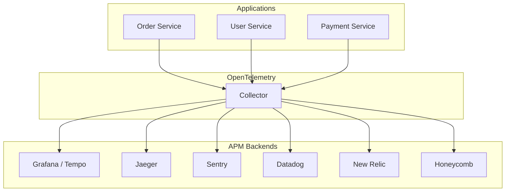
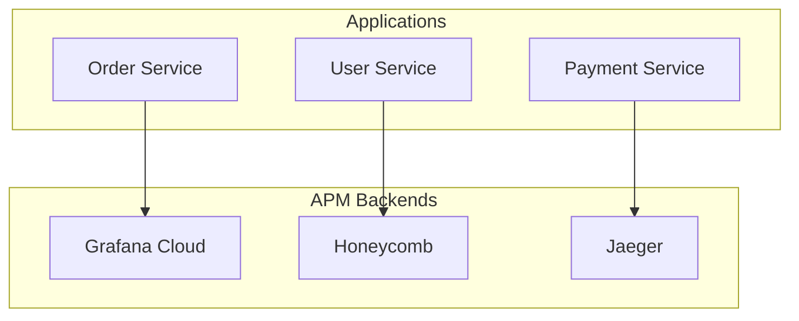
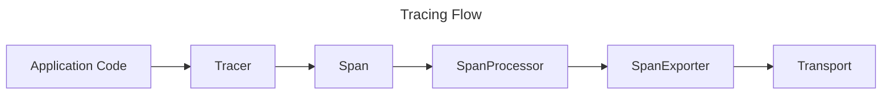
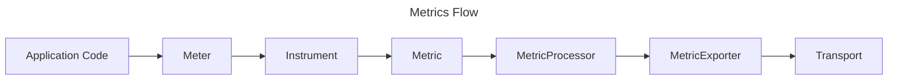
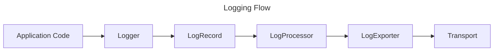
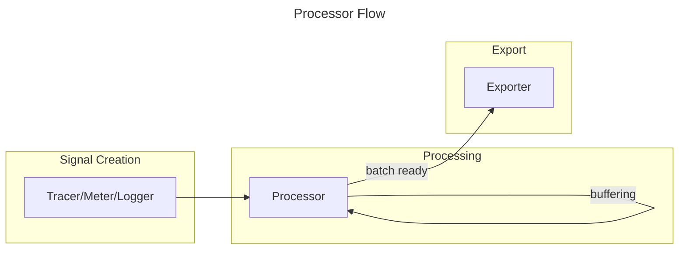

# Telemetry

Flow Telemetry is a lightweight, OpenTelemetry-compatible observability library for PHP applications. It provides a
unified API for distributed tracing, metrics collection, and structured logging with minimal dependencies.

[PACKAGE_NAV]

[TOC]

## Installation

For detailed installation instructions, see the [installation page](/documentation/installation/packages/telemetry.md).

## Telemetry

The `Telemetry` class is the main entry point for all observability operations. It manages providers for each signal
type and provides access to Tracers, Meters, and Loggers.

> **Note**: The core telemetry library provides contracts and basic exporters like Console, Memory, and Void.
> To send telemetry to external backends, you need the either use
> the [OTLP Bridge](/documentation/components/bridges/telemetry-otlp-bridge.md)
> or implement custom exporters.
>
> The whole point of this library is to provide a unified, consistent API for telemetry that comes with minimal
> dependencies,
> clean contracts, and zero magic.
>
> You can find our contracts [here](/documentation/components/libs/telemetry/contracts.md).

### Basic Setup with Memory Providers (Testing)

```php
<?php

use function Flow\Telemetry\DSL\{
    telemetry,
    resource,
    tracer_provider,
    meter_provider,
    logger_provider,
    memory_span_processor,
    memory_metric_processor,
    memory_log_processor,
};

$resource = resource([
    'service.name' => 'test-service',
    'service.version' => '1.0.0',
]);

$spanProcessor = memory_span_processor();
$metricProcessor = memory_metric_processor();
$logProcessor = memory_log_processor();

$telemetry = telemetry(
    $resource,
    tracer_provider($spanProcessor),
    meter_provider($metricProcessor),
    logger_provider($logProcessor),
);

// Get instrumented components
$tracer = $telemetry->tracer('my-component');
$meter = $telemetry->meter('my-component');
$logger = $telemetry->logger('my-component');

// Use telemetry...
$span = $tracer->span('operation');
$tracer->complete($span);

$meter->createCounter('events', 'count')->add(1);

$logger->info('Something happened');

// Inspect collected data
$spans = $spanProcessor->endedSpans();
$metrics = $metricProcessor->metrics();
$logs = $logProcessor->entries();
```

### Scope vs Signal Attributes

`tracer()`, `meter()`, and `logger()` accept two distinct attribute sets:

- **Scope attributes** (`$attributes`) are attached to the instrumentation scope and shared, unchanged, by every signal
  the instrument emits.
- **Default signal attributes** (`$signalAttributes`) are merged into every individual signal (each span, metric data
  point, or log record) the instrument produces. Attributes supplied at the call site override the configured defaults
  of the same key.

```php
<?php

use Flow\Telemetry\Attributes;

$logger = $telemetry->logger(
    'my-service',
    '1.0.0',
    attributes: Attributes::create(['service.tier' => 'backend']),        // scope
    signalAttributes: Attributes::create(['deployment.environment' => 'prod']), // every record
);

// Emitted record carries deployment.environment=prod (default) and request.id=abc (per-call).
$logger->info('request handled', ['request.id' => 'abc']);

// Per-call value wins over the default of the same key.
$logger->info('overridden', ['deployment.environment' => 'staging']);
```

### Console Output Setup (Development)

```php
<?php

use function Flow\Telemetry\DSL\{
    telemetry,
    resource,
    tracer_provider,
    meter_provider,
    logger_provider,
    pass_through_span_processor,
    pass_through_metric_processor,
    pass_through_log_processor,
    console_exporter,
};

$resource = resource([
    'service.name' => 'my-app',
    'deployment.environment' => 'development',
]);

$telemetry = telemetry(
    $resource,
    tracer_provider(pass_through_span_processor(console_exporter())),
    meter_provider(pass_through_metric_processor(console_exporter())),
    logger_provider(pass_through_log_processor(console_exporter())),
);

// All telemetry will be printed to console
$tracer = $telemetry->tracer('http-handler');
$span = $tracer->span('handle-request');
$span->setAttribute('http.method', 'GET');
$span->setAttribute('http.url', '/api/users');
$tracer->complete($span);
```

### Lifecycle Management

Always call `shutdown()` when your application terminates to ensure all buffered telemetry is exported:

```php
<?php

// Register shutdown handler for graceful termination
$telemetry->registerShutdownFunction();

// Or manually flush and shutdown
$telemetry->flush();    // Export any buffered data
$telemetry->shutdown(); // Flush and close transports
```

`registerShutdownFunction()` holds only a **weak reference**: it does not keep the `Telemetry` instance alive, and an
instance that was garbage collected before process end is skipped. Keep the instance referenced (e.g. in your container)
for as long as it should be shut down at exit.

> For production OTLP export setup, see
> the [OTLP Bridge documentation](/documentation/components/bridges/telemetry-otlp-bridge.md).

## High Level Overview

Flow Telemetry is designed as a **contract library** that defines interfaces and provides basic implementations for
observability. While the library works standalone with built-in Console, Memory, and Void exporters, its true power
comes when paired with the [OTLP Bridge](/documentation/components/bridges/telemetry-otlp-bridge.md) for sending data to
Application Performance Monitoring (APM) backends.

### Architecture with OpenTelemetry Collector

The recommended production setup uses the OpenTelemetry Collector as a central hub for receiving, processing, and
routing telemetry data:



The OpenTelemetry Collector acts as a vendor-agnostic proxy that can:

- Receive telemetry from multiple sources
- Process and transform data (batching, filtering, sampling)
- Export to multiple backends simultaneously

> For more information about the OpenTelemetry Collector, see
> the [official documentation](https://opentelemetry.io/docs/collector/).

### Direct APM Integration

For simpler setups or specific requirements, you can send telemetry directly to APM backends that support OTLP:



> **Important**: The core `flow-php/telemetry` library provides the API and basic exporters (Console, Memory, Void).
> To send telemetry to external backends, you need the `flow-php/telemetry-otlp-bridge` package which provides OTLP
> serialization and transport capabilities.

## Signals

Telemetry collects three types of signals, each serving a distinct purpose in understanding your application's behavior.

### Traces

Traces track the flow of requests through your application and across services. A trace consists of one or more **spans
**, where each span represents a unit of work with a start time, duration, and optional attributes.

**Use cases:**

- Debugging slow requests by identifying bottlenecks
- Understanding request flow across microservices
- Correlating errors with specific operations



**Basic example:**

```php
<?php

use Flow\Telemetry\Tracer\SpanKind;

$tracer = $telemetry->tracer('my-service', '1.0.0');

$span = $tracer->span('process-order', SpanKind::INTERNAL);
$span->setAttribute('order.id', '12345');
$span->setAttribute('order.total', 99.99);

// ... do work ...

$tracer->complete($span);
```

**Nesting spans:**

Creating a span does not make it the current one - per the OpenTelemetry specification, span creation must not change
the active context. A span created inside another becomes its child only if the outer span was activated:

```php
<?php

$order = $tracer->span('process-order');
$scope = $tracer->activate($order);

try {
    // child of 'process-order'
    $tracer->complete($tracer->span('charge-card'));
} finally {
    $scope->detach();
    $tracer->complete($order);
}
```

Without `activate()`, `charge-card` is a sibling of `process-order`, not a child.

Detach scopes in reverse order of activation, and before completing the span. `Scope::detach()` returns
`Scope::DETACHED` on success, `Scope::INACTIVE` if the scope was already detached, and `Scope::MISMATCH` if it was not
the innermost active scope.

Do **not** activate a span whose lifetime is an object rather than a block - a file stream, a database cursor, a
long-running transaction handle. Several of those are open at once, so activating them makes each the parent of
whichever is opened next, producing a staircase instead of siblings. Start such spans and leave them inactive.

For automatic exception handling and span completion, use the `trace()` method:

```php
<?php

$result = $tracer->trace('fetch-user', function () use ($userId) {
    return $userRepository->find($userId);
});
```

**Suppressing tracing for a region:**

Set the tracing-suppression flag on the active context to make any spans created within a region **non-recording**
(never sampled, never exported). This is OpenTelemetry's tracing-scoped suppression (the equivalent of
`suppressTracing`) -
useful to silence noisy background work such as a queue worker's transport polling. Only traces are affected;
**metrics and logs still flow**.

```php
<?php

$scope = $contextStorage->attach($contextStorage->current()->withSuppressedTracing());

try {
    // Any $tracer->span(...) created here is non-recording and never exported.
    $poll();
} finally {
    $scope->detach();
}

// $contextStorage->current()->isTracingSuppressed() is false again here.
```

Use `withoutSuppressedTracing()` to lift suppression for a nested region (e.g. to trace real work inside an otherwise
suppressed loop).

### Metrics

Metrics are numerical measurements that track the state and performance of your application over time. Flow Telemetry
supports four metric instruments:

| Instrument        | Description                         | Example                          |
|-------------------|-------------------------------------|----------------------------------|
| **Counter**       | Monotonically increasing value      | Total requests, orders processed |
| **UpDownCounter** | Value that can increase or decrease | Active connections, queue size   |
| **Gauge**         | Point-in-time measurement           | CPU usage, memory consumption    |
| **Histogram**     | Distribution of values              | Request latency, response sizes  |



**Basic example:**

```php
<?php

$meter = $telemetry->meter('my-service', '1.0.0');

$requestCounter = $meter->createCounter('http.requests.total', 'requests');
$requestCounter->add(1, ['method' => 'POST', 'status' => 200]);

$latencyHistogram = $meter->createHistogram('http.request.duration', 'ms');
$latencyHistogram->record(125.5, ['endpoint' => '/api/orders']);

$connectionGauge = $meter->createGauge('db.connections.active', 'connections');
$connectionGauge->record(42, ['pool' => 'primary']);

$queueCounter = $meter->createUpDownCounter('queue.messages', 'messages');
$queueCounter->add(1);   // message added
$queueCounter->add(-1);  // message processed
```

### Logs

Logs capture discrete events with structured data and severity levels. Unlike traditional logging, telemetry logs are
correlated with traces, allowing you to see log entries in the context of specific requests.

| Severity | Value | Method    |
|----------|-------|-----------|
| TRACE    | 1     | `trace()` |
| DEBUG    | 5     | `debug()` |
| INFO     | 9     | `info()`  |
| WARN     | 13    | `warn()`  |
| ERROR    | 17    | `error()` |
| FATAL    | 21    | `fatal()` |



**Basic example:**

```php
<?php

$logger = $telemetry->logger('my-service', '1.0.0');

$logger->info('Order processed successfully', [
    'order_id' => '12345',
    'customer_id' => 'cust-789',
    'total' => 99.99,
]);

$logger->error('Payment failed', [
    'order_id' => '12345',
    'error_code' => 'CARD_DECLINED',
]);

$logger->debug('Cache hit', ['key' => 'user:123', 'ttl' => 3600]);
```

## Attribute and Cardinality Limits

Flow Telemetry enforces limits on signals following the OpenTelemetry specification. This prevents unbounded memory
growth and ensures telemetry data doesn't exceed collector size limits.

### Default Limits

| Signal Type | Attribute Count | Value Length | Events | Links | Cardinality |
|-------------|-----------------|--------------|--------|-------|-------------|
| Span        | 128             | unlimited    | 128    | 128   | N/A         |
| Span Event  | 128             | unlimited    | -      | -     | N/A         |
| Span Link   | 128             | unlimited    | -      | -     | N/A         |
| LogRecord   | 128             | unlimited    | -      | -     | N/A         |
| Metric      | exempt          | exempt       | -      | -     | 2000        |

**Note:** Resource attributes are exempt from limits per the OTel specification. Metrics are exempt from attribute count
and value length limits, but have cardinality limits (unique attribute combinations per instrument).

### Configuring Limits

```php
<?php

use function Flow\Telemetry\DSL\{span_limits, log_record_limits, metric_limits, tracer_provider, logger_provider, meter_provider};

// Custom span limits
$spanLimits = span_limits(
    attributeCountLimit: 64,
    eventCountLimit: 32,
    linkCountLimit: 16,
    attributeValueLengthLimit: 1024,  // truncate strings longer than 1024 chars
);

$tracerProvider = tracer_provider(
    $processor,
    $clock,
    $contextStorage,
    limits: $spanLimits,
);

// Custom log limits
$logLimits = log_record_limits(
    attributeCountLimit: 64,
    attributeValueLengthLimit: 2048,
);

$loggerProvider = logger_provider(
    $processor,
    $clock,
    $contextStorage,
    limits: $logLimits,
);

// Custom metric limits (cardinality only)
$metricLimits = metric_limits(
    cardinalityLimit: 1000,  // max unique attribute combinations per instrument
);

$meterProvider = meter_provider(
    $processor,
    $clock,
    limits: $metricLimits,
);
```

### Enforcement Behavior

- **Attribute count exceeded**: New attributes are discarded (first N kept)
- **String value too long**: Values are truncated to the configured limit
- **Array values**: Each string element is truncated individually

Dropped attribute counts are tracked per signal and included in exported telemetry data for observability.

### Metric Cardinality Overflow

When a metric instrument exceeds its cardinality limit, new attribute combinations are redirected to an overflow
aggregator. The overflow data point has a single attribute:
`otel.metric.overflow: true`. All measurements that would create new attribute combinations beyond the limit are
aggregated into this overflow data point.

This follows the OpenTelemetry specification for metrics overflow handling - measurements are never dropped, they are
aggregated into the overflow bucket for observability.

## Processors

Processors handle the lifecycle of telemetry signals, determining when and how data is passed to exporters. They sit
between the instrumentation (Tracer, Meter, Logger) and the exporters.



### Processor Types

| Type            | Behavior                                         | Use Case                                     |
|-----------------|--------------------------------------------------|----------------------------------------------|
| **PassThrough** | Exports immediately on every signal              | Development, debugging, immediate visibility |
| **Batching**    | Buffers signals, exports when batch size reached | Production, performance optimization         |
| **Memory**      | Stores signals in memory for inspection          | Testing, assertions                          |
| **Void**        | Discards all signals (no-op)                     | Disabled telemetry, library defaults         |

**Batching processor example:**

The batching processor collects signals until a configured batch size is reached, then exports them all at once. This
reduces network overhead and improves performance in production environments.

```php
<?php

use function Flow\Telemetry\DSL\batching_span_processor;
use function Flow\Telemetry\DSL\console_exporter;

$processor = batching_span_processor(
    console_exporter(),
    batchSize: 512
);

// Spans are buffered until 512 are collected, then exported together
// Call flush() to export immediately regardless of batch size
$processor->flush();
```

Each signal type has its own processor implementations:

- `PassThroughSpanProcessor`, `BatchingSpanProcessor`, `MemorySpanProcessor`, `VoidSpanProcessor`
- `PassThroughMetricProcessor`, `BatchingMetricProcessor`, `MemoryMetricProcessor`, `VoidMetricProcessor`
- `PassThroughLogProcessor`, `BatchingLogProcessor`, `MemoryLogProcessor`, `VoidLogProcessor`

### Filtering by attributes

Attribute filtering drops (or keeps) signals based on their attributes, which is useful for reducing noise - for example
discarding health-check spans or bot traffic before it reaches an exporter. For spans and metrics this is a processor
wrapping an inner processor; for logs it is a middleware in a
[log pipeline](#log-processing-pipeline) (see below). Both forward only the signals that survive an
`AttributeFilter`.

An `AttributeFilter` evaluates a single root **matcher**. The leaf matcher, `attribute_rule()`, targets an attribute
*path* and applies a `MatchMode`:

| Family   | Modes                                                                                 |
|----------|---------------------------------------------------------------------------------------|
| Equality | `EQUAL`, `NOT_EQUAL` (strict comparison against the expected value)                   |
| Ordering | `GREATER_THAN`, `GREATER_THAN_EQUAL`, `LESS_THAN`, `LESS_THAN_EQUAL`                  |
| Pattern  | `REGEXP`, `STARTS_WITH`, `ENDS_WITH`, `CONTAINS` (operate on the value's string form) |

A path is one segment (a top-level attribute key) or several segments descending into nested array values (e.g.
`['user', 'id']`). The pattern modes accept a per-rule `caseSensitive` flag (default `true`).

Rules compose with the `all()`, `any()` and `not()` matchers - each is itself a matcher, so they nest freely:

```php
<?php

use Flow\Telemetry\Filter\MatchMode;

use function Flow\Telemetry\DSL\any;
use function Flow\Telemetry\DSL\attribute_filter;
use function Flow\Telemetry\DSL\attribute_filtering_span_processor;
use function Flow\Telemetry\DSL\attribute_rule;
use function Flow\Telemetry\DSL\batching_span_processor;
use function Flow\Telemetry\DSL\console_exporter;

// Drop health-check spans OR any span faster than 5ms before they are exported
$processor = attribute_filtering_span_processor(
    batching_span_processor(console_exporter()),
    attribute_filter(
        any(
            attribute_rule('http.route', MatchMode::EQUAL, '/health'),
            attribute_rule(['timing', 'duration_ms'], MatchMode::LESS_THAN, 5),
        ),
    )
);
```

A single rule can be passed directly, without wrapping it in `all()`/`any()`:

```php
$filter = attribute_filter(attribute_rule('http.route', MatchMode::EQUAL, '/health'));
```

By default a match **excludes** the signal (drops it). Set `exclude: false` to keep ONLY matching signals, and point the
filter at resource and/or scope attributes instead of the signal's own with
`sources` (a list - the matcher is run against each and OR-combined, so a signal matches if the matcher matches in
**any** listed source):

```php
<?php

use Flow\Telemetry\Filter\AttributeSource;
use Flow\Telemetry\Filter\MatchMode;

use function Flow\Telemetry\DSL\all;
use function Flow\Telemetry\DSL\attribute_filter;
use function Flow\Telemetry\DSL\attribute_rule;
use function Flow\Telemetry\DSL\not;

// Keep ONLY metrics from the payments scope that are not internal
$filter = attribute_filter(
    all(
        attribute_rule('name', MatchMode::EQUAL, 'app.payments'),
        not(attribute_rule('internal', MatchMode::EQUAL, true)),
    ),
    exclude: false,
    sources: [AttributeSource::SCOPE],
);
```

The matcher tree is compiled to a small PHP matcher cached on disk (in the system temp directory by default, or a
directory passed as `cacheDir`) so per-signal evaluation stays cheap. When the cache directory is not writable - or a
matcher cannot be compiled - the processor transparently falls back to interpreted matching. Custom matchers implement
the `Matcher` interface (and optionally
`CompilableMatcher` to take part in code generation).

> **Security:** the compiled matcher is `require`d, so the cache directory must be **trusted** - never
> writable by untrusted users. Rule values are escaped (via `var_export`) and signal attributes are
> never written into the generated code, so neither can inject PHP; the risk is a shared, writable cache
> directory letting another user pre-plant code at the deterministic file path. The default
> (`sys_get_temp_dir()`) is world-accessible - pass an application-private `cacheDir` in multi-tenant
> environments. The directory is created with `0700` (owner-only); pass `cacheDirPermissions` to widen it
> (e.g. `0750` when a different reader user shares the group), validated to `0` - `0777` and applied only on
> creation.

For **spans** and **metrics**, filtering is a processor that wraps an inner processor:
`AttributeFilteringSpanProcessor` / `AttributeFilteringMetricProcessor`, created with
`attribute_filtering_span_processor()` and `attribute_filtering_metric_processor()`.

### Log processing pipeline

Logs are processed by a **pipeline** of ordered **middleware** terminating in a single **sink**, mirroring the
OpenTelemetry `LogRecordProcessor` model (each step may modify the record - which the spec explicitly allows - or drop
it, with changes visible to the next step). A `LogMiddleware` returns the entry to pass on (possibly enriched) or `null`
to drop it; a `LogSink` (batching, pass-through, memory, void, composite) exports the survivors.

```php
<?php

use Flow\Telemetry\Filter\MatchMode;
use Flow\Telemetry\Logger\Severity;

use function Flow\Telemetry\DSL\attribute_filter;
use function Flow\Telemetry\DSL\attribute_filtering_log_middleware;
use function Flow\Telemetry\DSL\attribute_rule;
use function Flow\Telemetry\DSL\batching_log_processor;
use function Flow\Telemetry\DSL\enriching_log_middleware;
use function Flow\Telemetry\DSL\pipeline_log_processor;
use function Flow\Telemetry\DSL\severity_filtering_log_middleware;

// enrich -> drop below WARN -> drop health checks -> batch to the exporter
$processor = pipeline_log_processor(
    [
        enriching_log_middleware(['deployment.environment' => 'prod']),
        severity_filtering_log_middleware(Severity::WARN),
        attribute_filtering_log_middleware(attribute_filter(
            attribute_rule('http.route', MatchMode::EQUAL, '/health'),
        )),
    ],
    batching_log_processor($exporter),
);
```

The middleware are `EnrichingLogMiddleware`, `AttributeFilteringLogMiddleware` and `SeverityFilteringLogMiddleware`
(`enriching_log_middleware()`, `attribute_filtering_log_middleware()`, `severity_filtering_log_middleware()`), composed
into a `PipelineLogProcessor` by `pipeline_log_processor()`. `EnrichingLogMiddleware`'s attributes are defaults -
attributes set at the call site win over them. Implement `LogMiddleware` to add your own step.

## Sampling

A `Sampler` decides, at span **start**, whether a span is recorded and exported. This is the OpenTelemetry-idiomatic way
to drop spans - a dropped span never records, so it never reaches a processor or exporter.

> **Breaking change.** `TracerProvider` and the `tracer_provider()` DSL helper now default their sampler to
> `ParentBasedSampler(AlwaysOnSampler)` instead of `AlwaysOnSampler`, matching the OpenTelemetry SDK
> default of `parentbased_always_on`. Spans whose parent is unsampled are now dropped. To restore the
> previous behaviour, pass `always_on_sampler()` explicitly.

| Sampler                    | DSL                                              | Behavior                                                                                                        |
|----------------------------|--------------------------------------------------|-----------------------------------------------------------------------------------------------------------------|
| `AlwaysOnSampler`          | `always_on_sampler()`                            | Record + sample every span                                                                                      |
| `AlwaysOffSampler`         | `always_off_sampler()`                           | Drop every span                                                                                                 |
| `TraceIdRatioBasedSampler` | `trace_id_ratio_based_sampler($ratio)`           | Sample a deterministic fraction of traces                                                                       |
| `ParentBasedSampler`       | `parent_based_sampler($root)`                    | Honor the parent's decision; use the root sampler for parentless spans (the default)                            |
| `AttributeMatchingSampler` | `attribute_matching_sampler($filter, $delegate)` | Drop spans whose **start-time** attributes match an `AttributeFilter`, deferring the rest to a delegate sampler |

`AttributeMatchingSampler` reuses the same matcher stack as the [filtering processors](#filtering-by-attributes) - the
`AttributeFilter` (matcher tree, compiled drop-closure, `sources`, `exclude` polarity). A match drops the span (the
default) or keeps only matching spans (`exclude: false`); everything else is decided by the `$delegate` sampler, so it
composes with ratio/parent-based sampling. It only sees attributes available at span start - end-state attributes
(status codes, durations) are not visible, so end-attribute filtering remains
a [span processor](#filtering-by-attributes)
concern.

```php
<?php

use Flow\Telemetry\Filter\MatchMode;

use function Flow\Telemetry\DSL\attribute_filter;
use function Flow\Telemetry\DSL\attribute_matching_sampler;
use function Flow\Telemetry\DSL\attribute_rule;
use function Flow\Telemetry\DSL\trace_id_ratio_based_sampler;

// Drop health-check spans; sample everything else at 10%
$sampler = attribute_matching_sampler(
    attribute_filter(attribute_rule('http.route', MatchMode::EQUAL, '/health')),
    trace_id_ratio_based_sampler(0.1),
);
```

## Exporters

Exporters are responsible for sending telemetry data to external systems. In the telemetry architecture, exporters
receive batches of signals from processors and transmit them using a transport mechanism.

An exporter typically requires two components:

- **Serializer** - Converts signals to a wire format (JSON, Protobuf)
- **Transport** - Handles the network communication (HTTP, gRPC)

> **Note**: The core telemetry library provides basic exporters. For OTLP-compatible serializers and transports, see
> the [OTLP Bridge documentation](/documentation/components/bridges/telemetry-otlp-bridge.md).

### Built-in Exporters

The telemetry library includes three types of exporters for different use cases:

#### Memory Exporters

Store signals in memory for direct access. Useful for testing and debugging.

```php
<?php

use function Flow\Telemetry\DSL\memory_exporter;
use function Flow\Telemetry\DSL\pass_through_span_processor;

$exporter = memory_exporter();
$processor = pass_through_span_processor($exporter);

// ... create and complete spans ...

$spans = $exporter->spans();
assert(count($spans) === 3);
assert($spans[0]->name === 'my-operation');
```

#### Console Exporters

Output human-readable telemetry to the console with optional ANSI colors. Useful for development and debugging.

```php
<?php

use function Flow\Telemetry\DSL\console_exporter;
use function Flow\Telemetry\DSL\pass_through_span_processor;

$exporter = console_exporter(colors: true);
$processor = pass_through_span_processor($exporter);
```

Console output displays spans in a formatted ASCII table with trace IDs, durations, attributes, and events.

#### Void Exporters

No-op implementations that discard all data. Use as defaults in libraries or when telemetry is disabled.

```php
<?php

use function Flow\Telemetry\DSL\void_span_processor;

// No performance impact - signals are discarded immediately
$processor = void_span_processor();
```

> **Performance Tip**: When building libraries, use Void processors as defaults. This ensures zero overhead when the
> consuming application doesn't configure telemetry, while still allowing instrumentation to be enabled when needed.

## Propagators

Propagators enable distributed tracing by extracting and injecting trace context across service boundaries (HTTP
headers, message queues, etc.).

Flow Telemetry includes two W3C-standard propagators:

- **W3CTraceContext** - Propagates trace IDs and span IDs via `traceparent` and `tracestate` headers
- **W3CBaggage** - Propagates application-specific key-value pairs via the `baggage` header

```php
<?php

use function Flow\Telemetry\DSL\composite_propagator;
use function Flow\Telemetry\DSL\array_carrier;
use Flow\Telemetry\Propagation\W3CTraceContext;
use Flow\Telemetry\Propagation\W3CBaggage;

$propagator = composite_propagator([
    new W3CTraceContext(),
    new W3CBaggage(),
]);

// Extract context from incoming request
$carrier = array_carrier($_SERVER);
$context = $propagator->extract($carrier);

// Inject context into outgoing request
$headers = [];
$carrier = array_carrier($headers);
$propagator->inject($context, $carrier);
```

### Resource

A **Resource** represents the entity producing telemetry - your application, service, or component. It contains
attributes that identify where telemetry data originated.

Common resource attributes:

- `service.name` - The logical name of the service
- `service.version` - The version of the service
- `host.name` - The hostname of the machine
- `process.pid` - The process ID

```php
<?php

use function Flow\Telemetry\DSL\resource;

$resource = resource([
    'service.name' => 'order-service',
    'service.version' => '2.1.0',
    'deployment.environment' => 'production',
]);
```

The Resource is passed to the Telemetry instance and automatically attached to all spans, metrics, and logs. This allows
APM backends to filter and group telemetry by service, environment, or any other attribute.

### Resource Detectors

Resource detectors automatically discover information about the entity producing telemetry. Instead of manually
specifying resource attributes, detectors can inspect the environment to populate attributes like OS type, hostname,
process ID, and service information.

#### Default Detection

The simplest way to detect resources is using the `resource_detector()` function, which provides a sensible default
chain of detectors:

```php
<?php

use function Flow\Telemetry\DSL\resource_detector;

$resource = resource_detector()->detect();
```

This returns a `Resource` with attributes from OS, host, process, Composer, and environment variables.

#### Available Detectors

| Detector            | DSL Function                         | Detected Attributes                                                                                                             |
|---------------------|--------------------------------------|---------------------------------------------------------------------------------------------------------------------------------|
| OsDetector          | `os_detector()`                      | `os.type`, `os.name`, `os.version`, `os.description`                                                                            |
| HostDetector        | `host_detector()`                    | `host.name`, `host.arch`, `host.id`                                                                                             |
| ProcessDetector     | `process_detector()`                 | `process.pid`, `process.executable.path`, `process.runtime.name`, `process.runtime.version`, `process.command`, `process.owner` |
| ComposerDetector    | `composer_detector()`                | `service.name`, `service.version`                                                                                               |
| EnvironmentDetector | `environment_detector()`             | Reads `OTEL_SERVICE_NAME`, `OTEL_RESOURCE_ATTRIBUTES`                                                                           |
| ManualDetector      | `manual_detector($attributes)`       | User-specified attributes                                                                                                       |
| CachingDetector     | `caching_detector($detector, $path)` | Caches wrapped detector's result to file                                                                                        |
| ChainDetector       | `chain_detector(...$detectors)`      | Combines multiple detectors                                                                                                     |

#### Custom Detection Chain

Use `chain_detector()` to combine specific detectors. Later detectors take precedence over earlier ones when there are
conflicting attribute keys:

```php
<?php

use function Flow\Telemetry\DSL\{chain_detector, os_detector, host_detector, manual_detector};

$resource = chain_detector(
    os_detector(),
    host_detector(),
    manual_detector(['service.name' => 'my-api', 'service.version' => '2.0.0']),
)->detect();
```

#### Manual Attributes

When you need full control over resource attributes:

```php
<?php

use function Flow\Telemetry\DSL\manual_detector;

$resource = manual_detector([
    'service.name' => 'order-service',
    'service.version' => '1.0.0',
    'deployment.environment.name' => 'production',
])->detect();
```

#### Caching Detection Results

Resource detection can involve filesystem reads (e.g., `/etc/machine-id` for host ID). Use `caching_detector()` to cache
results and avoid repeated detection:

```php
<?php

use function Flow\Telemetry\DSL\{caching_detector, resource_detector};

$resource = caching_detector(resource_detector())->detect();
```

The cache is stored in `sys_get_temp_dir()/flow_telemetry_resource.cache` by default. You can specify a custom path as
the second argument.

#### Environment Variables

The `EnvironmentDetector` reads standard OpenTelemetry environment variables:

- `OTEL_SERVICE_NAME` - Sets the `service.name` attribute
- `OTEL_RESOURCE_ATTRIBUTES` - Sets additional attributes in `key=value,key2=value2` format

Per the OpenTelemetry Resource SDK specification, `,` and `=` inside keys and values MUST be percent-encoded (other
characters MAY be); both keys and values are percent-decoded. For example,
`note=a%2Cb` yields the attribute `note` with value `a,b`.

```bash
export OTEL_SERVICE_NAME=my-service
export OTEL_RESOURCE_ATTRIBUTES=service.version=1.0.0,deployment.environment.name=production
```

These environment variables take highest precedence in the default detector chain, allowing runtime configuration
without code changes.

### InstrumentationScope

An **InstrumentationScope** identifies the library or component that generates telemetry. It allows APM backends to
attribute telemetry to specific instrumentation and filter by library version.

```php
<?php

// InstrumentationScope is created automatically when you get a tracer/meter/logger
$tracer = $telemetry->tracer(
    name: 'http-client',
    version: '1.2.0',
    schemaUrl: 'https://opentelemetry.io/schemas/1.21.0'
);
```

The scope includes:

- **name** - Name of the instrumentation library (e.g., `http-client`, `database`, `queue`)
- **version** - Version of the instrumentation
- **schemaUrl** - Optional URL pointing to the semantic convention schema used
