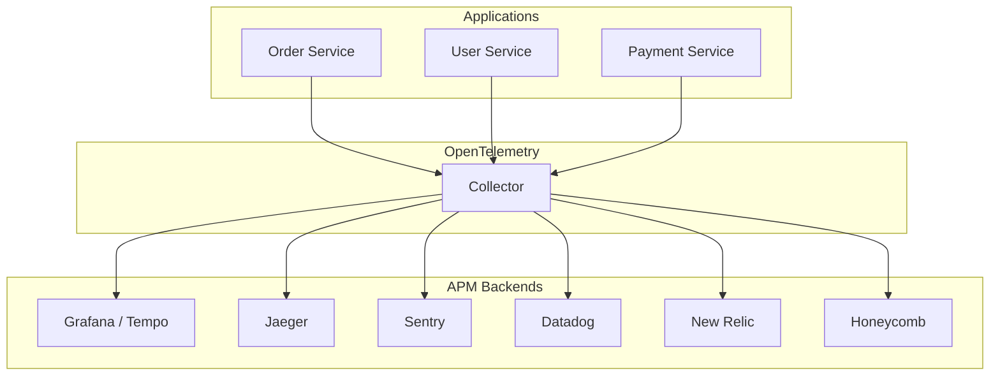
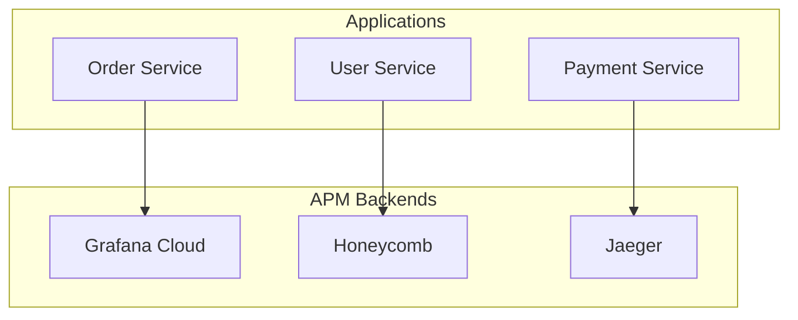
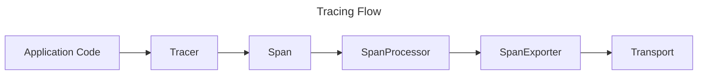
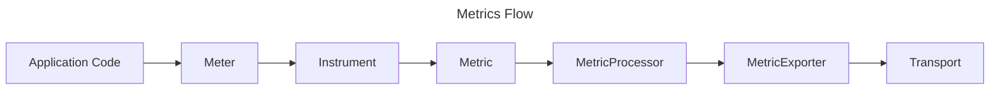
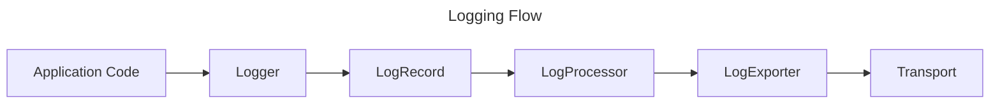
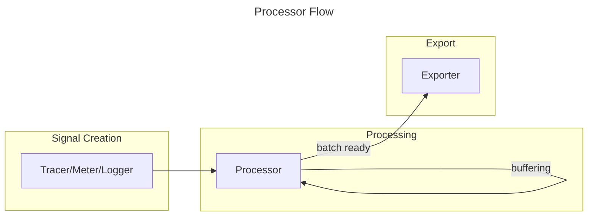

# Telemetry

Flow Telemetry is a lightweight, OpenTelemetry-compatible observability library for PHP applications.
It provides a unified API for distributed tracing, metrics collection, and structured logging with minimal dependencies.

- [⬅️️ Back](/documentation/introduction.md)
- [📦Packagist](https://packagist.org/packages/flow-php/telemetry)
- [🐙GitHub](https://github.com/flow-php/telemetry)
- [📚API Reference](/documentation/api/lib/telemetry)
- [🗺DSL](/documentation/api/lib/telemetry/namespaces/flow-telemetry-dsl.html)

[TOC]

## Installation

```
composer require flow-php/telemetry:~--FLOW_PHP_VERSION--
```

## Telemetry

The `Telemetry` class is the main entry point for all observability operations.
It manages providers for each signal type and provides access to Tracers, Meters, and Loggers.

> **Note**: The core telemetry library provides contracts and basic exporters like Console, Memory, and Void.
> To send telemetry to external backends, you need the either use the [OTLP Bridge](/documentation/components/bridges/telemetry-otlp-bridge.md)
> or implement custom exporters.
> 
> The whole point of this library is to provide a unified, consistent API for telemetry that comes with minimal dependencies,
> clean contracts, and zero magic.
>
> You can find our contracts [here](/documentation/components/libs/telemetry/contracts.md).


### Basic Setup with Memory Providers (Testing)

```php
<?php

use function Flow\Telemetry\DSL\{
    telemetry,
    resource,
    tracer_provider,
    meter_provider,
    logger_provider,
    memory_span_processor,
    memory_metric_processor,
    memory_log_processor,
};

$resource = resource([
    'service.name' => 'test-service',
    'service.version' => '1.0.0',
]);

$spanProcessor = memory_span_processor();
$metricProcessor = memory_metric_processor();
$logProcessor = memory_log_processor();

$telemetry = telemetry(
    $resource,
    tracer_provider($spanProcessor),
    meter_provider($metricProcessor),
    logger_provider($logProcessor),
);

// Get instrumented components
$tracer = $telemetry->tracer('my-component');
$meter = $telemetry->meter('my-component');
$logger = $telemetry->logger('my-component');

// Use telemetry...
$span = $tracer->span('operation');
$tracer->complete($span);

$meter->createCounter('events', 'count')->add(1);

$logger->info('Something happened');

// Inspect collected data
$spans = $spanProcessor->endedSpans();
$metrics = $metricProcessor->collectedMetrics();
$logs = $logProcessor->collectedLogs();
```

### Console Output Setup (Development)

```php
<?php

use function Flow\Telemetry\DSL\{
    telemetry,
    resource,
    tracer_provider,
    meter_provider,
    logger_provider,
    pass_through_span_processor,
    pass_through_metric_processor,
    pass_through_log_processor,
    console_span_exporter,
    console_metric_exporter,
    console_log_exporter,
};

$resource = resource([
    'service.name' => 'my-app',
    'deployment.environment' => 'development',
]);

$telemetry = telemetry(
    $resource,
    tracer_provider(pass_through_span_processor(console_span_exporter())),
    meter_provider(pass_through_metric_processor(console_metric_exporter())),
    logger_provider(pass_through_log_processor(console_log_exporter())),
);

// All telemetry will be printed to console
$tracer = $telemetry->tracer('http-handler');
$span = $tracer->span('handle-request');
$span->setAttribute('http.method', 'GET');
$span->setAttribute('http.url', '/api/users');
$tracer->complete($span);
```

### Lifecycle Management

Always call `shutdown()` when your application terminates to ensure all buffered telemetry is exported:

```php
<?php

// Register shutdown handler for graceful termination
$telemetry->registerShutdownFunction();

// Or manually flush and shutdown
$telemetry->flush();    // Export any buffered data
$telemetry->shutdown(); // Flush and close transports
```

> For production OTLP export setup, see
> the [OTLP Bridge documentation](/documentation/components/bridges/telemetry-otlp-bridge.md).

## High Level Overview

Flow Telemetry is designed as a **contract library** that defines interfaces and provides basic implementations for
observability.
While the library works standalone with built-in Console, Memory, and Void exporters, its true power comes when paired
with the [OTLP Bridge](/documentation/components/bridges/telemetry-otlp-bridge.md) for sending data to Application
Performance Monitoring (APM) backends.

### Architecture with OpenTelemetry Collector

The recommended production setup uses the OpenTelemetry Collector as a central hub for receiving, processing, and
routing telemetry data:



The OpenTelemetry Collector acts as a vendor-agnostic proxy that can:

- Receive telemetry from multiple sources
- Process and transform data (batching, filtering, sampling)
- Export to multiple backends simultaneously

> For more information about the OpenTelemetry Collector, see
> the [official documentation](https://opentelemetry.io/docs/collector/).

### Direct APM Integration

For simpler setups or specific requirements, you can send telemetry directly to APM backends that support OTLP:



> **Important**: The core `flow-php/telemetry` library provides the API and basic exporters (Console, Memory, Void).
> To send telemetry to external backends, you need the `flow-php/telemetry-otlp-bridge` package which provides OTLP
> serialization and transport capabilities.

## Signals

Telemetry collects three types of signals, each serving a distinct purpose in understanding your application's behavior.

### Traces

Traces track the flow of requests through your application and across services. A trace consists of one or more **spans
**, where each span represents a unit of work with a start time, duration, and optional attributes.

**Use cases:**

- Debugging slow requests by identifying bottlenecks
- Understanding request flow across microservices
- Correlating errors with specific operations



**Basic example:**

```php
<?php

use Flow\Telemetry\Tracer\SpanKind;

$tracer = $telemetry->tracer('my-service', '1.0.0');

$span = $tracer->span('process-order', SpanKind::INTERNAL);
$span->setAttribute('order.id', '12345');
$span->setAttribute('order.total', 99.99);

// ... do work ...

$tracer->complete($span);
```

For automatic exception handling and span completion, use the `trace()` method:

```php
<?php

$result = $tracer->trace('fetch-user', function () use ($userId) {
    return $userRepository->find($userId);
});
```

### Metrics

Metrics are numerical measurements that track the state and performance of your application over time. Flow Telemetry
supports four metric instruments:

| Instrument        | Description                         | Example                          |
|-------------------|-------------------------------------|----------------------------------|
| **Counter**       | Monotonically increasing value      | Total requests, orders processed |
| **UpDownCounter** | Value that can increase or decrease | Active connections, queue size   |
| **Gauge**         | Point-in-time measurement           | CPU usage, memory consumption    |
| **Histogram**     | Distribution of values              | Request latency, response sizes  |



**Basic example:**

```php
<?php

$meter = $telemetry->meter('my-service', '1.0.0');

$requestCounter = $meter->createCounter('http.requests.total', 'requests');
$requestCounter->add(1, ['method' => 'POST', 'status' => 200]);

$latencyHistogram = $meter->createHistogram('http.request.duration', 'ms');
$latencyHistogram->record(125.5, ['endpoint' => '/api/orders']);

$connectionGauge = $meter->createGauge('db.connections.active', 'connections');
$connectionGauge->record(42, ['pool' => 'primary']);

$queueCounter = $meter->createUpDownCounter('queue.messages', 'messages');
$queueCounter->add(1);   // message added
$queueCounter->add(-1);  // message processed
```

### Logs

Logs capture discrete events with structured data and severity levels. Unlike traditional logging, telemetry logs are
correlated with traces, allowing you to see log entries in the context of specific requests.

| Severity | Value | Method    |
|----------|-------|-----------|
| TRACE    | 1     | `trace()` |
| DEBUG    | 5     | `debug()` |
| INFO     | 9     | `info()`  |
| WARN     | 13    | `warn()`  |
| ERROR    | 17    | `error()` |
| FATAL    | 21    | `fatal()` |



**Basic example:**

```php
<?php

$logger = $telemetry->logger('my-service', '1.0.0');

$logger->info('Order processed successfully', [
    'order_id' => '12345',
    'customer_id' => 'cust-789',
    'total' => 99.99,
]);

$logger->error('Payment failed', [
    'order_id' => '12345',
    'error_code' => 'CARD_DECLINED',
]);

$logger->debug('Cache hit', ['key' => 'user:123', 'ttl' => 3600]);
```

## Processors

Processors handle the lifecycle of telemetry signals, determining when and how data is passed to exporters.
They sit between the instrumentation (Tracer, Meter, Logger) and the exporters.



### Processor Types

| Type            | Behavior                                         | Use Case                                     |
|-----------------|--------------------------------------------------|----------------------------------------------|
| **PassThrough** | Exports immediately on every signal              | Development, debugging, immediate visibility |
| **Batching**    | Buffers signals, exports when batch size reached | Production, performance optimization         |
| **Memory**      | Stores signals in memory for inspection          | Testing, assertions                          |
| **Void**        | Discards all signals (no-op)                     | Disabled telemetry, library defaults         |

**Batching processor example:**

The batching processor collects signals until a configured batch size is reached, then exports them all at once.
This reduces network overhead and improves performance in production environments.

```php
<?php

use function Flow\Telemetry\DSL\batching_span_processor;
use function Flow\Telemetry\DSL\console_span_exporter;

$processor = batching_span_processor(
    console_span_exporter(),
    batchSize: 512
);

// Spans are buffered until 512 are collected, then exported together
// Call flush() to export immediately regardless of batch size
$processor->flush();
```

Each signal type has its own processor implementations:

- `PassThroughSpanProcessor`, `BatchingSpanProcessor`, `MemorySpanProcessor`, `VoidSpanProcessor`
- `PassThroughMetricProcessor`, `BatchingMetricProcessor`, `MemoryMetricProcessor`, `VoidMetricProcessor`
- `PassThroughLogProcessor`, `BatchingLogProcessor`, `MemoryLogProcessor`, `VoidLogProcessor`

## Exporters

Exporters are responsible for sending telemetry data to external systems. In the telemetry architecture, exporters
receive batches of signals from processors and transmit them using a transport mechanism.

An exporter typically requires two components:

- **Serializer** - Converts signals to a wire format (JSON, Protobuf)
- **Transport** - Handles the network communication (HTTP, gRPC)

> **Note**: The core telemetry library provides basic exporters. For OTLP-compatible serializers and transports, see
> the [OTLP Bridge documentation](/documentation/components/bridges/telemetry-otlp-bridge.md).

### Built-in Exporters

The telemetry library includes three types of exporters for different use cases:

#### Memory Exporters

Store signals in memory for direct access. Useful for testing and debugging.

```php
<?php

use function Flow\Telemetry\DSL\memory_span_exporter;
use function Flow\Telemetry\DSL\pass_through_span_processor;

$exporter = memory_span_exporter();
$processor = pass_through_span_processor($exporter);

// ... create and complete spans ...

$spans = $exporter->spans();
assert(count($spans) === 3);
assert($spans[0]->name === 'my-operation');
```

#### Console Exporters

Output human-readable telemetry to the console with optional ANSI colors. Useful for development and debugging.

```php
<?php

use function Flow\Telemetry\DSL\console_span_exporter;
use function Flow\Telemetry\DSL\pass_through_span_processor;

$exporter = console_span_exporter(colors: true);
$processor = pass_through_span_processor($exporter);
```

Console output displays spans in a formatted ASCII table with trace IDs, durations, attributes, and events.

#### Void Exporters

No-op implementations that discard all data. Use as defaults in libraries or when telemetry is disabled.

```php
<?php

use function Flow\Telemetry\DSL\void_span_processor;

// No performance impact - signals are discarded immediately
$processor = void_span_processor();
```

> **Performance Tip**: When building libraries, use Void processors as defaults. This ensures zero overhead when the
> consuming application doesn't configure telemetry, while still allowing instrumentation to be enabled when needed.

## Propagators

Propagators enable distributed tracing by extracting and injecting trace context across service boundaries (HTTP
headers, message queues, etc.).

Flow Telemetry includes two W3C-standard propagators:

- **W3CTraceContext** - Propagates trace IDs and span IDs via `traceparent` and `tracestate` headers
- **W3CBaggage** - Propagates application-specific key-value pairs via the `baggage` header

```php
<?php

use function Flow\Telemetry\DSL\composite_propagator;
use function Flow\Telemetry\DSL\array_carrier;
use Flow\Telemetry\Propagation\W3CTraceContext;
use Flow\Telemetry\Propagation\W3CBaggage;

$propagator = composite_propagator([
    new W3CTraceContext(),
    new W3CBaggage(),
]);

// Extract context from incoming request
$carrier = array_carrier($_SERVER);
$context = $propagator->extract($carrier);

// Inject context into outgoing request
$headers = [];
$carrier = array_carrier($headers);
$propagator->inject($context, $carrier);
```

### Resource

A **Resource** represents the entity producing telemetry - your application, service, or component.
It contains attributes that identify where telemetry data originated.

Common resource attributes:

- `service.name` - The logical name of the service
- `service.version` - The version of the service
- `host.name` - The hostname of the machine
- `process.pid` - The process ID

```php
<?php

use function Flow\Telemetry\DSL\resource;

$resource = resource([
    'service.name' => 'order-service',
    'service.version' => '2.1.0',
    'deployment.environment' => 'production',
]);
```

The Resource is passed to the Telemetry instance and automatically attached to all spans, metrics, and logs.
This allows APM backends to filter and group telemetry by service, environment, or any other attribute.

### InstrumentationScope

An **InstrumentationScope** identifies the library or component that generates telemetry.
It allows APM backends to attribute telemetry to specific instrumentation and filter by library version.

```php
<?php

// InstrumentationScope is created automatically when you get a tracer/meter/logger
$tracer = $telemetry->tracer(
    name: 'http-client',
    version: '1.2.0',
    schemaUrl: 'https://opentelemetry.io/schemas/1.21.0'
);
```

The scope includes:

- **name** - Name of the instrumentation library (e.g., `http-client`, `database`, `queue`)
- **version** - Version of the instrumentation
- **schemaUrl** - Optional URL pointing to the semantic convention schema used
